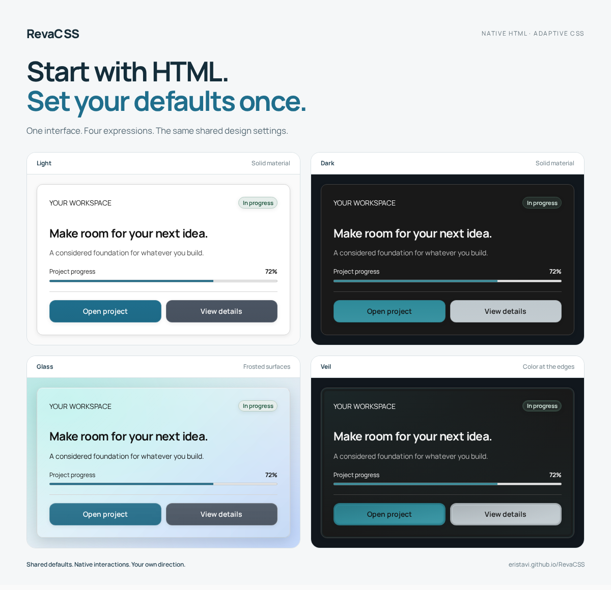

# RevaCSS

**Start with HTML. Set your defaults once.**

A CSS framework for building consistent interfaces with native HTML, shared appearance settings and a small set of structural classes. Choose a theme, palette, shape and spacing on a page or section, then refine individual components where needed.

[Documentation](https://eristavi.github.io/RevaCSS/) · [Quick start](#quick-start) · [Live demos](#live-demos) · [Framework comparison](https://eristavi.github.io/RevaCSS/guide/comparison/) · [AI guide](AI.md)

**Latest published release: 1.2.1 · Erisian** · [Download](https://github.com/eristavi/RevaCSS/releases/tag/v1.2.1) · [MIT license](LICENSE)

[](https://eristavi.github.io/RevaCSS/demos/marketing/)

## Why RevaCSS?

- **Shared design decisions.** Set appearance defaults on a parent instead of repeating them on every component. Local overrides change only the settings you choose.
- **HTML and CSS first.** Native controls, disclosures and popovers provide browser behaviour. The framework core has no JavaScript runtime; compiled CSS works without a build step.
- **Customise with ordinary CSS.** Design tokens, custom properties, cascade layers and low-specificity selectors leave room for your own styles.
- **A coordinated visual system.** Light, dark and system themes, 14 palettes, shared sizing and spacing, plus optional surface and button materials.

Appearance inheritance is implemented through CSS rules and custom properties; HTML data attributes do not inherit by themselves. RevaCSS works with static HTML, server-rendered templates and frameworks that render HTML.

## Quick start

Download the [compiled stylesheet](https://github.com/eristavi/RevaCSS/releases/download/v1.2.1/reva-1.2.1.min.css), save it as `reva.min.css` beside your HTML, and link it:

```html
<!doctype html>
<html lang="en" data-theme="auto" data-palette="default" data-shape="rounded">
  <head>
    <meta charset="utf-8">
    <meta name="viewport" content="width=device-width, initial-scale=1">
    <title>My RevaCSS page</title>
    <link rel="stylesheet" href="reva.min.css">
  </head>
  <body>
    <main class="container">
      <article class="card">
        <h1>Start with your next idea.</h1>
        <p>Native HTML, with a consistent appearance.</p>
        <a class="button" href="https://eristavi.github.io/RevaCSS/guide/">
          Explore the guide
        </a>
      </article>
    </main>
  </body>
</html>
```

Native elements receive shared defaults. Classes such as `.card`, `.container`, `.grid` and `.stack` identify reusable structures.

For starter HTML, optional stylesheets, icons and the bundled font, download the [complete release](https://github.com/eristavi/RevaCSS/releases/tag/v1.2.1). See [installation options](https://eristavi.github.io/RevaCSS/guide/) and the [npm guide](NPM.md) for package and CDN availability. The GitHub release is the available 1.2.1 distribution; npm publication is not yet confirmed.

## Configure once, refine locally

Place shared settings on `<html>` or a section. A local setting changes that choice while the remaining appearance settings continue to inherit through the CSS system.

```html
<section data-theme="dark" data-palette="violet" data-size="large">
  <button type="button">Save changes</button>
  <button type="button" class="secondary" data-size="small">Back</button>
</section>
```

These example buttons demonstrate appearance. Connect application actions to your own handlers or use a real form destination.

| Attribute | Supported choices |
| --- | --- |
| `data-theme` | `auto`, `light`, `dark` |
| `data-palette` | `default`, `ocean`, `violet` and 11 other palettes |
| `data-shape` | `square`, `subtle`, `rounded`, `pill` |
| `data-density` | `compact`, `comfortable`, `spacious` |
| `data-size` | `small`, `medium`, `large` |
| `data-motion` | `none`, `subtle`, `expressive` |

Browse the [attribute reference](https://eristavi.github.io/RevaCSS/attributes/), [inheritance guide](https://eristavi.github.io/RevaCSS/guide/styling/) and [public CSS tokens](https://eristavi.github.io/RevaCSS/reference/tokens/).

## Components and extensions

The core includes forms and actions, cards and layouts, navigation and disclosures, tables, status indicators and content patterns. Shared settings apply to supported components without a separate styling vocabulary for each one.

| Area | Included patterns |
| --- | --- |
| Forms and actions | Native fields, form/input groups, buttons, switches, ratings and action groups |
| Navigation | Top menus, sidebars, app shells, drawers, dropdowns, breadcrumbs, pagination and steps |
| Content | Cards, card grids, lists, metrics, timelines, calendars, message threads and avatars |
| Feedback | Alerts, badges, progress/meter, loading indicators, skeletons and empty states |
| Media | Responsive images, SVG chart patterns and native scroll-snap galleries |

See the [component API](https://eristavi.github.io/RevaCSS/reference/components/) for markup, dependencies and behaviour boundaries.

Optional stylesheets add [Glass](https://eristavi.github.io/RevaCSS/themes/glass/), [Veil](https://eristavi.github.io/RevaCSS/themes/veil/), [Soft UI](https://eristavi.github.io/RevaCSS/themes/soft/), [button materials](https://eristavi.github.io/RevaCSS/themes/button-materials/), [motion](https://eristavi.github.io/RevaCSS/guide/motion/) and [enhanced native selects](https://eristavi.github.io/RevaCSS/components/selects/). Load an extension after the matching core:

```html
<link rel="stylesheet" href="reva.min.css">
<link rel="stylesheet" href="reva.glass.css">

<article class="card" data-material="glass">
  <h2>A different surface.</h2>
  <p>The same HTML and shared settings.</p>
</article>
```

Complete, minified, scoped and modular builds are available. Use `reva.scoped.css` inside a `.reva` boundary when integrating with an existing site, and use matching scoped extensions. Fonts and [SVG icons](https://eristavi.github.io/RevaCSS/icons/) are separate assets. The [stylesheet reference](https://eristavi.github.io/RevaCSS/reference/) explains file choices and dependencies.

## Live demos

Explore complete websites, change their appearance with the customizer and download the starting HTML.

| Demo | What you can explore |
| --- | --- |
| [Forma · Marketing](https://eristavi.github.io/RevaCSS/demos/marketing/) | Navigation, features, pricing, FAQ and a contact layout |
| [Workspace · Dashboard](https://eristavi.github.io/RevaCSS/demos/dashboard/) | App shell, metrics, SVG charts and activity history |
| [Fieldnotes · Journal](https://eristavi.github.io/RevaCSS/demos/blog/) | Articles, archives, categories and author profiles |
| [Still · Shop](https://eristavi.github.io/RevaCSS/demos/shop/) | Catalogue, product pages, galleries and a sample bag |

Demos use sample content. Your application supplies form processing, commerce, routing and live data. The optional demo customizer uses JavaScript to remember settings and prepare downloads; the CSS core remains independent of it.

## AI-assisted development and vibe coding

Readable HTML and documented appearance settings give coding assistants clear patterns to follow. You can describe a layout, generate a starting point, then refine it through shared settings and ordinary CSS.

Give your assistant the relevant references for the release or source build you use:

- [AI.md](AI.md): framework conventions, starter HTML and application responsibilities.
- [Documentation index](https://eristavi.github.io/RevaCSS/llms.txt): links to focused Markdown references.
- [Structured API](https://eristavi.github.io/RevaCSS/ai/api.json): supported values, component contracts and examples.
- [HTML editor custom data](https://eristavi.github.io/RevaCSS/ai/html-custom-data.json): attribute descriptions and completion values.

The online references regenerate from the documentation manifests and examples. They include source-preview availability notes where features are unreleased. Providing this context helps an assistant use the intended API; review generated markup and behaviour as you would any other code.

## Why I started this project

> I started RevaCSS because I wanted consistent interfaces without repeating the same design decisions across every component. My aim is to keep HTML readable, use the browser’s native capabilities, and let components share appearance settings that are easy to understand and customise.

— **Revaz Eristavi**, founder of RevaCSS

Read the [full founder’s note](https://eristavi.github.io/RevaCSS/guide/why-revacss/) or [compare RevaCSS with other frameworks](https://eristavi.github.io/RevaCSS/guide/comparison/).

## Release and source status

| Distribution | Status |
| --- | --- |
| **Published 1.2.1 · Erisian** | Compiled CSS and complete archives are available from the [GitHub release](https://github.com/eristavi/RevaCSS/releases/tag/v1.2.1). |
| **Current `main` and documentation preview** | Includes unreleased responsive wrappers, RTL refinements, form/native-control improvements, accessibility and print utilities, and the iOS date/time sizing fix. Tests for these additions are deferred. |

Published archives remain unchanged. See the [new features and availability guide](https://eristavi.github.io/RevaCSS/guide/responsive-rtl-print/) and [changelog](CHANGELOG.md) before using source-preview additions with a released package.

RevaCSS targets modern browsers. Native popovers require browser support; optional enhancements document their fallbacks. Accessible results also depend on your HTML and application behaviour. See [behaviour and accessibility](https://eristavi.github.io/RevaCSS/guide/accessibility/) and the [published release’s validation record](https://github.com/eristavi/RevaCSS/blob/v1.2.1/quality/releases/v1.2.1.md) for recorded coverage and known limits.

## Contributing

For documentation or framework development, clone the repository and use Node 22.12 or newer; Node 24 is recommended.

```sh
git clone https://github.com/eristavi/RevaCSS.git
cd RevaCSS
npm ci
npm run dev
```

`npm run build` generates compiled CSS, AI references and the Astro documentation. GitHub Pages deploys from `main`. For a bug report, include the browser/device, the stylesheet version, relevant HTML and a screenshot or reproduction where possible.

<details>
<summary>Validation and release commands</summary>

Run these when validation is requested. Python 3 is required for the browser-test server.

```sh
npm run build
npm test
npx playwright install --with-deps chromium firefox webkit
npm run test:browser
npm run test:package
npm run test:package:browser
npm run check:release-quality
```

Checks cover source contracts, generated output, installed packages and browser behaviour. Manual accessibility and real-device review remain separate requirements. Current source additions have not completed this validation.

After building, `npm run release:package` creates release archives in `artifacts/`. Package publication retains its existing quality gates.

See the [component quality standard](QUALITY_STANDARD.md), [specification](SPECIFICATION.md), [implementation record](IMPLEMENTATION.md) and [versioning policy](VERSIONING.md). Record user-visible changes in the changelog and bump the version once per published release.

</details>

## License

RevaCSS is [MIT licensed](LICENSE). The bundled Manrope font uses the [SIL Open Font License](assets/fonts/OFL.txt).
